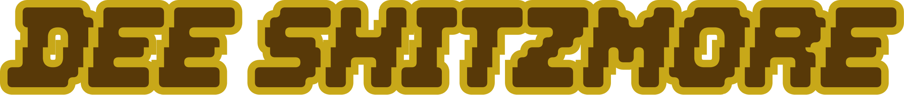
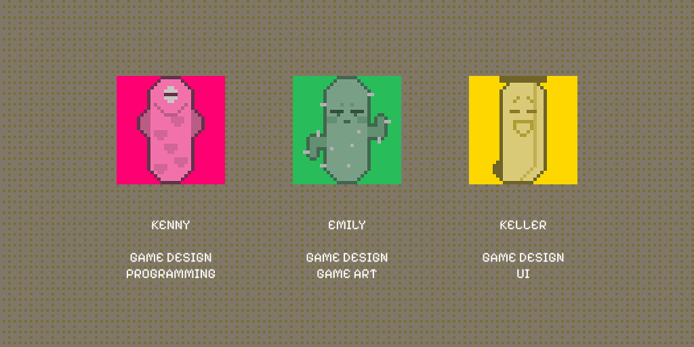

# Dee Shitzmore

Buy food, strengthen your organs, and try to reach the daily toilet-clogging goal within five days.

🎮 **[Play Dee Shitzmore on itch.io](https://kuro7777.itch.io/dee-shitzmore)**

🏆 **[View Gameplay GIF and rate our GMTK Game Jam 2026 submission](https://itch.io/jam/gmtk-jam-2026/rate/4828301)**

## About the Game

*Dee Shitzmore* is a pixel-art game about surviving five increasingly desperate days in the bathroom. Produce the longest poop you can, react to QTEs, earn money, and prepare for the next day by buying food and upgrading your organs.

<!-- Add a captured gameplay screenshot here when one is available. -->

## How to Play

- Click or hold the left mouse button to poop.
- Press Space when a QTE appears.
- Failing a QTE breaks off the current poop segment, but the round continues.
- Spend your earnings on food and organ upgrades between days.
- Reach the daily clogging target before the five-day run ends.

## Controls

| Input | Action |
| --- | --- |
| Left Mouse Button | Click / Hold |
| Space | QTE |
| Menu Button | Pause |

## Built With

- Godot 4.7.1
- GDScript

## Team

- Kenny — Game Design, Programming
- Emily — Game Design, Game Art
- Keller — Game Design, UI

Created by a three-person team for **GMTK Game Jam 2026**.
