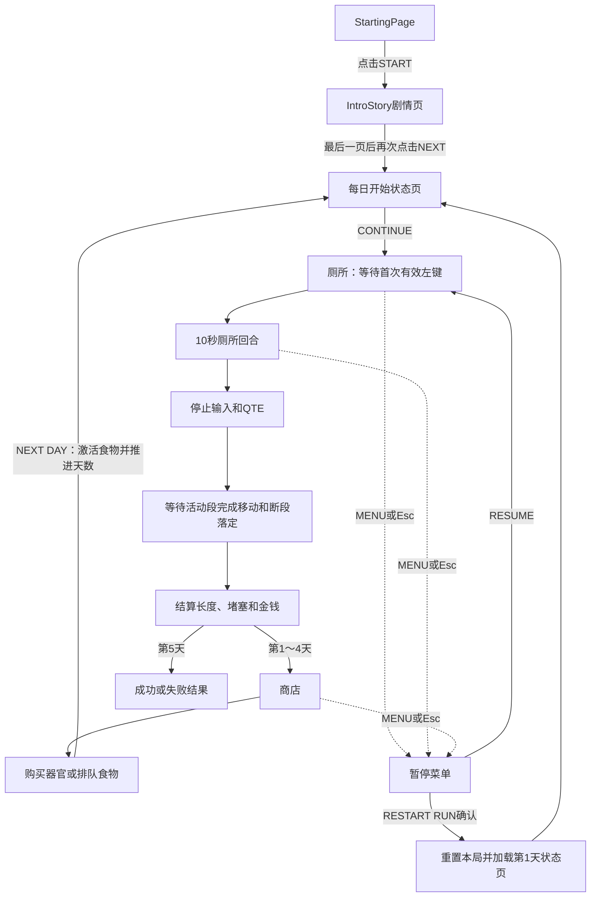

# 当前游戏机制

本文档根据当前场景和 GDScript 整理。项目主场景为 `res://scenes/StartingPage.tscn`，点击START后先进入 `res://scenes/IntroStory.tscn`，完成剧情页后进入每日开始状态页，再由玩家继续进入厕所。

## 1. 核心玩法循环

1. 启动项目后显示StartingPage；点击START进入IntroStory剧情页。
2. 玩家逐页点击NEXT，让剧情纸张从厕纸后移动到中央；最后一页显示完成后再次点击进入每日开始状态页。
3. 每日开始页显示剩余天数、三个厕所玩法器官状态和当天生效食物；点击CONTINUE进入厕所。
4. 进入厕所后生成 Poop，但倒计时暂不启动。
5. 第一次有效按下鼠标左键后，10 秒回合与 QTE 调度同时开始。
6. 玩家通过单击或长按延长当前 Poop 段；QTE失败会夹断并立即开始新段。
7. 倒计时归零后停止新输入与 QTE，等待活动段完成推出和所有断段完成下落。
8. 统一结算最终长度、堵塞进度和金钱。
9. 第 1～4 天可进入商店，再点击 `NEXT DAY` 激活食物、推进天数并显示下一天状态页。
10. 第 5 天直接显示成功或失败结果。

主要文件：`res://scripts/toilet.gd`、`res://scripts/shop.gd`。

## 2. 玩家属性

`PlayerStats` Autoload 是以下三个整数属性的唯一数据来源：

- `storage_capacity`：储存量，初始值 `5`。
- `smoothness`：顺滑度，初始值 `5`。
- `integrity`：完整度，初始值 `5`。

三个属性范围均为 `0～10`，提供读取、设置和升级方法，并在变化时发出 `stats_changed` 信号。属性可跨厕所、商店和不同天数保留，完全关闭游戏后重置。

目前只有厕所场景实例化 `StatsHUD` 组件显示三个属性；商店暂时不显示 StatsHUD。StatsHUD 初次进入时读取有效属性，之后同时监听 `PlayerStats.stats_changed` 和 `FoodSystem.food_state_changed` 实时更新，不保存另一份属性数据，也不使用每帧轮询：

- `STORAGE: 5 / 10`
- `SMOOTHNESS: 5 / 10 - NORMAL`
- `INTEGRITY: 5 / 10 - NORMAL`

顺滑度会显示 HARD、NORMAL、TOO LOOSE；完整度会显示 CRUMBLY、NORMAL、STEEL GIANT。

储存量会限制每轮可加入推出目标的Poop总量：每点有效储存量提供 `10 cm` 储备。有效储存量 `5` 时每轮为 `50 cm`，有效储存量 `10` 时为 `100 cm`。

主要文件：`res://scripts/player_stats.gd`、`res://scripts/components/stats_hud.gd`。

## 3. 器官升级

`OrganProgression` Autoload 是四种器官等级的唯一数据来源，等级可跨厕所、商店和天数保留，完全关闭游戏后重置：

- 胃、大肠、括约肌、腹肌初始均为 `0` 级，最高 `5` 级。
- 下一级价格为 `(当前等级 + 1) × 30`，依次为 `30、60、90、120、150`。
- `OrganProgression`通过 `Economy.try_spend_money()`安全扣除现有总金钱；钱不足或满级时不能升级。
- 当前商店开放四种器官购买，并显示器官等级、下一级价格、对应效果和总金钱。
- 胃的食物槽数量始终通过 `1 + 胃等级` 计算，0级为 `1`，5级为 `6`，不会保存第二份可变槽位数据。
- 胃只提供食物槽数量，不保存食物物品；实际购买与每日效果由独立的 `FoodSystem` 管理。
- 大肠每升一级调用 `PlayerStats.upgrade_storage_capacity(1)`，使默认储存量从 `5` 最高提升到 `10`。
- 腹肌每升一级为长按推出距离增加 `10%`，倍率为 `1.0 + 腹肌等级 × 0.1`。
- 腹肌只影响达到长按阈值后的推出：当前基础范围为 `40～150 px`，5级实际为 `60～225 px`。
- 普通单击始终推出 `20 px`；腹肌不会改变3秒最大蓄力时间或蓄力条增长速度。
- 括约肌每升一级让QTE目标判定区域增加 `10%`，倍率为 `1.0 + 括约肌等级 × 0.1`。
- QTE最终目标宽度为“基础宽度 × 完整度倍率 × 括约肌倍率”，每次QTE开始时重新计算，不会累计修改基础宽度。
- 括约肌只扩大成功区域，不改变QTE出现频率、指针速度、透明度或所需连续成功次数。
- 每次进入厕所会按当前储存量重新装满本轮储备；同一轮所有活动段和夹断后的新段共享该储备。
- 单击和长按都会在加入推出目标时消费储备；长按先应用腹肌倍率，再由剩余储备限制实际推出距离。
- 剩余储备不足时只推出剩余部分；归零后不能继续推出，但倒计时与QTE仍正常运行。
- Poop缩回、QTE夹断或已消费但尚未完成的移动都不会返还储备。

主要文件：`res://scripts/organ_progression.gd`、`res://scripts/economy.gd`、`res://scripts/shop.gd`。

## 4. 食物系统

第一版食物定义集中在 `res://scripts/food/food_definitions.gd`：

| 食物 | 价格 | 蓄力 | 储存量 | 顺滑度 | 完整度 | 价值 |
| --- | ---: | ---: | ---: | ---: | ---: | ---: |
| 西梅 | $5 | +1 | +2 | +3 | -1 | x1.0 |
| 咖啡 | $5 | +2 | 0 | +2 | -2 | x1.0 |
| 红薯 | $10 | 0 | +3 | -2 | +2 | x1.2 |
| 牛油果 | $15 | +1 | +2 | +2 | +1 | x1.3 |
| 玉米 | $15 | 0 | 0 | 0 | 0 | x1.35 |

- `FoodSystem`是唯一的跨场景食物状态，分别保存商店待生效食物与当前厕所回合食物。
- 食物在商店购买时立即通过 `Economy`扣钱并占用一个胃槽位；同一购买周期内同种食物只能买一次。
- 点击 `NEXT DAY` 后待生效食物转为当前回合效果；该厕所回合完成统一结算后清除。
- 第1天没有上一个商店阶段，因此默认没有食物效果。食物效果清除后，厕所中的 StatsHUD 会恢复显示基础属性。
- 食物不会写回 `PlayerStats`基础属性。有效属性为“基础属性 + 当前食物加成”，并限制在 `0～10`。
- 蓄力每 `+1` 增加 `10%`长按推出距离，并与腹肌倍率相乘；不影响单击或3秒蓄力上限。
- 多份食物价值采用加法：`1.0 + Σ(单份倍率 - 1.0)`，最高为 `x2.0`。
- 当前没有背包、退款、重复购买、特殊配方、正式食物美术或持久化存档。

主要文件：`res://scripts/food/food_system.gd`、`res://scripts/player_stats.gd`、`res://scripts/shop.gd`。

## 5. 厕所回合与鼠标输入

- 初始剩余时间为 10 秒，`CountdownTimer` 处于停止状态。
- 第一次有效左键按下会启动 Timer 和 QTE 调度，同一次输入仍正常参与判定。
- 左键按住少于 `0.3` 秒后松开，推出 `20 px`。
- 按住达到 `0.3` 秒后进入长按；长按期间当前操作不会推动 Poop。
- 松开长按时，根据按住时间一次推出当前基础范围 `40～150 px`，再应用腹肌与食物倍率。
- 按住达到 `3.0` 秒时蓄力和推出距离封顶。
- `ChargeBar` 从鼠标按下瞬间开始显示总按住时间的 `0～100%` 进度，松开或操作取消后归零。
- 单击和长按不消耗体力，但会消耗本轮共享的Poop储备；储备仍有剩余时可以不限次数操作。
- 倒计时到 0 时禁止新输入并自动释放当前操作。
- QTE失败时若正在蓄力，会取消当前操作；玩家必须松开左键后才能操作新段。
- QTE夹断、倒计时结束或其他输入取消都会清空当前蓄力；暂停时蓄力计时和显示保持冻结。
- 回合等待活动段完成已有移动、所有断段完成下落后才结算。
- `has_settled_round` 保证金钱和堵塞只结算一次。

主要文件：`res://scripts/toilet.gd`。

## 6. Poop 分段、移动与长度

- 当前活动段的 `TopMarker` 固定对齐厕所的 `PoopSpawnMarker`。
- `BottomMarker` 表示活动段最下端，推出距离累加到目标长度，并使用 `move_toward()`平滑延长。
- 占位 Sprite2D 根据 TopMarker 与 BottomMarker 的距离纵向延长，顶部保持固定且宽度不变。
- 默认移动速度为 `400 px/s`。
- 每次推出移动完成后等待 `0.3` 秒；若没有新的左键操作，Poop 会以 `20 px/s` 持续缩回。
- 新的有效左键操作会立即停止缩回并重置空闲等待，之后从当前缩回位置继续推出。
- 活动段最多缩回到0长度，到达后保持稳定；已断段不能推出、缩回或再次夹断。
- 单段长度按 `BottomMarker.global_position.y - TopMarker.global_position.y` 的非负距离计算。
- 默认 `pixels_per_cm = 10`，即 `10 px = 1 cm`。
- `PoopEndMarker` 是堵塞计算阈值，不是硬终点。
- 当前活动段超出长度按 `BottomMarker` 超过阈值的距离计算。
- Poop段状态为 `ACTIVE`、`FALLING`、`SETTLED`。断段默认使用 `0.5` 秒线性 Tween，让切断端从 Spawn 落到 End。
- QTE失败会保存当前活动段的实际长度；非零段开始下落，同时立即生成新的0长度活动段。零长度段不会播放掉落。
- 回合总长度为所有已断段的固定长度加当前活动段长度，夹断时只累计一次。
- 缩回会实时降低当前活动段长度与堵塞预览，最终价格仍按回合结束时的总长度计算。
- 回合开始前、倒计时归零后、结算期间或游戏暂停时不会缩回。

主要文件：`res://scripts/poop.gd`、`res://scripts/toilet.gd`、`res://scenes/poop.tscn`。

## 7. 顺滑度与 QTE 频率

StatsHUD 与厕所QTE读取 `PlayerStats`提供的有效顺滑度：

- `0～4`：`HARD`，QTE 随机间隔 `1～3` 秒，正常指针速度。
- `5～7`：`NORMAL`，QTE 随机间隔 `2～5` 秒，正常指针速度。
- `8～10`：`TOO LOOSE`，QTE 随机间隔 `2～5` 秒，指针速度默认为正常值的 `1.5` 倍。

顺滑度只决定 QTE 出现频率和指针速度。规则映射集中在 `qte_rules.gd`，厕所不再保存重复的顺滑度变量。

## 8. 完整度与 QTE 判定

当前有效完整度决定 QTE 显示、目标宽度、所需成功次数和价格倍率：

- `0～4`（稀碎）：
  - 使用普通单次判定和普通目标宽度。
  - 整个 QTE 在 `0.4～1.0` 透明度之间循环，但不会完全消失。
  - 最终价值倍率为 `0.8`。
- `5～7`（正常）：
  - 使用正常显示、普通目标宽度和单次判定。
  - 最终价值倍率为 `1.0`。
- `8～10`（钢铁巨屎）：
  - 同一条 QTE 的目标宽度默认为普通宽度的 `1.5` 倍。
  - 必须连续成功两次，进度显示为 `1 / 2`、`2 / 2`。
  - 第一次成功只重新随机目标，不结束 QTE。
  - 任意一次失败都会立即结束，并且只发出一次失败信号。
  - 本轮至少成功完成一次双重 QTE 后，最终价值倍率为 `1.2`；否则为 `1.0`。

双重 QTE 直接取代普通单次 QTE，不会额外生成第二条 QTE。一次 QTE 启动时会锁定配置，过程中改变属性只影响下一次 QTE。

主要文件：`res://scripts/qte_rules.gd`、`res://scripts/components/qte_bar.gd`。

## 9. QTE 调度与夹断

- 复用 `res://scenes/components/qte_bar.tscn`，没有第二套 QTE。
- QTE 只在厕所回合开始后调度。
- 当前 QTE 成功或失败结束后，才开始下一次随机等待。
- 未激活时按空格没有效果。
- 倒计时归零时停止等待并取消当前 QTE。
- QTE 失败使 `break_count` 增加 1，并更新 `BreakCountLabel`。
- 失败会夹断当前实际长度、让旧段下落并立即生成新活动段；厕所回合和QTE调度继续。
- 双重QTE任意一次失败仍只发出一次失败信号，因此只夹断一次。
- 夹断不会直接扣除长度、堵塞或其他资源，零长度失败不会生成掉落段。
- `break_count` 当前不降低价格。

独立测试场景为 `res://scenes/tests/qte_test.tscn`，默认仍测试普通单次 QTE。

## 10. 金钱与价格

基础每厘米价格由 `Economy.money_per_cm` 保存，当前为 `0.5`。

```text
最终金钱 = floor(最终长度 × 每厘米价格 × 完整度价值倍率 × 食物价值倍率)
```

- 完整度 `0～4`：倍率 `0.8`。
- 完整度 `5～7`：倍率 `1.0`。
- 完整度 `8～10` 且本轮成功完成过双重 QTE：倍率 `1.2`。
- 完整度 `8～10` 但未完成双重 QTE：倍率 `1.0`。
- 夹断次数不参与价格公式。
- 食物价值倍率使用当前回合已激活食物的加法结果，并限制在 `x1.0～x2.0`。
- 厕所只通过 `MoneyEarnedLabel` 显示本轮获得的金钱，不显示累计总金钱。
- 商店通过 `TotalMoneyLabel` 显示 `Economy.total_money`。
- `Economy.total_money` 作为 Autoload 跨场景和天数保留，完全重启游戏后重置。

主要文件：`res://scripts/economy.gd`、`res://scripts/toilet.gd`。

## 11. 堵塞进度

- 每超出阈值 `1 cm` 增加 `2` 点堵塞进度。
- 回合中 `ClogProgressBar` 显示已有堵塞加本轮预览：所有 SETTLED 段完整长度，加活动段超过阈值的长度。
- FALLING段落定前不计入堵塞，落定后按完整段长度计入。
- 回合结束时才把最终增量一次性写入 `GameState.clog_progress`。
- 堵塞范围为 `0～100`，目标为 `80`，可跨场景和天数保留。

`ClogTargetLabel` 会显示当前目标百分比。当前阈值超出量使用 `BottomMarker`，不是 `TopMarker`。

## 12. 天数与商店

- 游戏共 5 天，`GameState.current_day` 初始为 1，最大为 5。
- 第 1～4 天结算后可进入商店。
- 商店的 `NEXT DAY` 只推进一天，并有防重复点击保护。
- `NEXT DAY` 会先激活排队食物并推进天数，再进入唯一的 `res://day_start.tscn`；每日状态页不会维护第二份日期或食物记录。
- 每日状态页按 `GameState.MAX_DAYS - current_day + 1` 显示 `5 DAYS` 至 `1 DAY`，单数使用 `DAY`。
- 页面中部显示大肠、括约肌和腹肌的现有图标、等级与当前效果；数值直接读取 `PlayerStats` 和 `OrganProgression` 的现有接口。
- `FoodContainer` 横向显示 `FoodSystem` 当前active食物，多个食物按现有数组顺序生成；没有当天食物时容器保持为空。红薯目前临时使用火龙果图标，食物规则仍是红薯定义。
- 点击每日状态页的 `CONTINUE` 才进入厕所；厕所Timer仍等待第一次有效左键输入。
- 第 5 天根据堵塞进度是否达到 80 显示成功或失败文字。
- 商店使用可滚动的左右双栏占位布局：左侧显示四种器官升级，右侧显示五种食物与下一天效果预览；顶部显示总金钱，底部保留 `NEXT DAY`。
- 器官栏显示等级、下一级价格、当前效果和升级按钮；余额不足或满级时按钮由现有购买规则禁用。
- 食物栏从 `FoodDefinitions` 读取名称、价格和效果，并显示 `FOOD SLOTS: 已使用 / 总数`；不会在场景中保存另一份食物数值。
- `QUEUED FOR DAY X` 区域显示已购买的待生效食物，并汇总 Charge、Storage、Smoothness、Integrity 与 Value；没有食物时显示 `EMPTY STOMACH`。
- 器官升级或食物购买后，商店会立即刷新总金钱、按钮状态、槽位和排队效果；实际食物生效流程仍由 `FoodSystem` 管理。
- 目前只有厕所显示 StatsHUD；商店暂时不显示属性状态栏，但跨场景属性仍由同一个 PlayerStats 保存。
- 商店尚未接入三个玩家属性的购买或升级。

主要文件：`res://scripts/game_state.gd`、`res://scripts/shop.gd`。

## 13. 暂停菜单

- 厕所和商店都复用 `res://scenes/components/pause_menu.tscn`。
- 两个场景右上角都有 `MENU` 按钮；点击它或按 `Esc`（`ui_cancel`）都会打开暂停主页。
- 暂停主页包含 `RESUME`、`OPTIONS` 和 `RESTART RUN`。点击 `RESUME` 或在暂停主页按 `Esc` 会继续游戏。
- `OPTIONS` 页面提供音乐音量滑动条，控制独立的 `Music` 音频总线，不影响 `Master`。
- 在 `OPTIONS` 页面按 `Esc` 或点击 `BACK` 只返回暂停主页，游戏继续保持暂停。
- `RESTART RUN` 会先显示确认页面；`CANCEL` 或按 `Esc` 只返回暂停主页，不修改状态。
- 确认 `RESTART` 后会把天数恢复为1、堵塞与总金钱归零、三项基础属性恢复5、四种器官恢复0级，并清空待生效和当前生效食物。
- 重新开始会解除暂停并进入第1天每日状态页；点击CONTINUE进入的新厕所中，10秒Timer仍保持停止，直到第一次有效左键输入。
- 重新开始不会重置Music总线音量；当前仍没有重开本日、主菜单、退出游戏或其他设置。
- 暂停时，厕所倒计时、QTE 等待计时、Poop 移动、QTE 指针与游戏输入都会停止。
- 恢复后继续使用暂停前的计时、位置、移动目标和 QTE 状态，不会重置或重新调度。
- PauseMenu 使用 `PROCESS_MODE_ALWAYS`，因此 SceneTree 暂停时仍能处理恢复输入；其他玩法节点保持默认暂停处理。
- PauseMenu 是场景内的可复用组件，不是 Autoload。组件退出场景树时会清理由自身设置的暂停状态。
- 音乐音量在当前游戏运行期间跨场景保留，但不会保存到磁盘；当前尚未添加实际背景音乐。

主要文件：`res://scenes/components/pause_menu.tscn`、`res://scripts/components/pause_menu.gd`、`res://default_bus_layout.tres`。

## 14. Autoload 与本局重置

当前 `project.godot` 注册了五个 Autoload，每种跨场景状态只有一个数据来源：

| Autoload | 保存的数据 | `RESTART RUN` 时的重置 |
| --- | --- | --- |
| `Economy` | `total_money` 与每厘米价格配置 | 总金钱归零；`money_per_cm` 配置保持不变 |
| `GameState` | 当前天数、跨天堵塞进度 | 恢复第1天、堵塞归零，并协调其他系统重置与每日状态页切换 |
| `PlayerStats` | 三项永久基础属性 | 储存量、顺滑度、完整度恢复为5 |
| `OrganProgression` | 四种器官等级 | 全部恢复0级；派生食物槽随胃等级恢复为1 |
| `FoodSystem` | 待生效与当前生效食物ID | 两个列表全部清空 |

Music总线音量不是本局玩法进度，不属于Autoload，也不会被 `RESTART RUN` 重置。当前没有磁盘存档，完全关闭游戏后会使用脚本与音频总线布局的默认值。

## 15. 当前场景流程



暂停恢复实际会返回打开菜单前的原场景和状态；图中的 `RESUME → 厕所等待` 仅表示恢复入口，不表示会重置或切换场景。

## 16. 正式场景、组件与测试入口

- 正式入口：`res://scenes/StartingPage.tscn`，由 `project.godot` 的主场景UID指向。
- 正式流程场景：`res://scenes/StartingPage.tscn`、`res://scenes/IntroStory.tscn`、`res://day_start.tscn`、`res://scenes/toilet.tscn` 与 `res://scenes/shop.tscn`。
- StartingPage的START按钮进入IntroStory，不会直接进入厕所。
- IntroStory由Inspector中的 `story_pages` 提供剧情文字。每次NEXT都会在固定出口实例化一张新的StoryPaperPage；所有页面都是PaperChain的子节点并保持固定局部间距。过渡时只使用一个线性Tween整体移动PaperChain，让新页到达中央、旧页同步向右推进并保持少量重叠，避免连接处短暂断开。移动期间按钮禁用，完成后厕纸暂停在当前帧。
- 最后一页出现时不会自动离开；玩家再次点击NEXT才进入每日状态页。空的 `story_pages` 会在第一次点击时直接进入每日状态页。
- 每日状态页复用GameState、PlayerStats、OrganProgression、FoodSystem与FoodDefinitions，只负责显示当前日状态和继续进入厕所，不保存重复数据。
- Poop场景：`res://scenes/poop.tscn`。
- 可复用组件：
  - `res://scenes/components/qte_bar.tscn`
  - `res://scenes/components/stats_hud.tscn`
  - `res://scenes/components/pause_menu.tscn`
- 独立测试场景：`res://scenes/tests/qte_test.tscn`。它只测试普通单次QTE及2～5秒随机调度，没有接入厕所、属性、器官、金钱或天数流程。
- `scenes/resources`中的图片以及厕所、商店中的部分视觉仍是占位内容，不代表额外玩法。

## 17. 重要可调参数

| 参数 | 文件 | 默认值 | 作用 |
| --- | --- | ---: | --- |
| `poop_move_speed` | `toilet.gd` | `400.0` | Poop移动速度 |
| `click_max_duration` | `toilet.gd` | `0.3` | 单击和长按分界 |
| `click_push_distance` | `toilet.gd` | `20.0` | 单击推出距离 |
| `max_charge_duration` | `toilet.gd` | `3.0` | 最大蓄力总时间 |
| `min/max_charge_push_distance` | `toilet.gd` | `40 / 150` | 长按推出距离基础范围 |
| `CM_PER_STORAGE_POINT` | `poop_reserve.gd` | `10.0` | 每点有效储存量提供的厘米储备 |
| `idle_retract_delay` | `toilet.gd` | `0.3` | 推出完成后的空闲缩回等待时间 |
| `poop_retract_speed` | `toilet.gd` | `20.0` | Poop缩回速度（像素/秒） |
| `fall_duration` | `poop.gd` | `0.5` | 断段从Spawn落到End的Tween时长 |
| `hard_qte_min/max_interval` | `toilet.gd` | `1 / 3` | HARD QTE间隔 |
| `normal_qte_min/max_interval` | `toilet.gd` | `2 / 5` | 其他QTE间隔 |
| `normal_qte_pointer_speed` | `toilet.gd` | `400.0` | 正常指针速度 |
| `loose_qte_speed_multiplier` | `toilet.gd` | `1.5` | 过稀速度倍率 |
| `high_integrity_target_width_multiplier` | `toilet.gd` | `1.5` | 高完整度目标宽度倍率 |
| `pointer_speed` | `qte_bar.gd` | `400.0` | QTE组件独立使用时的默认指针速度；厕所会在每次QTE前配置实际速度 |
| `target_area_width` | `qte_bar.gd` | `120.0` | 普通目标宽度 |
| `faded_min_alpha` | `qte_bar.gd` | `0.4` | 稀碎QTE最低透明度 |
| `faded_pulse_speed` | `qte_bar.gd` | `3.0` | 透明度变化速度 |
| `pixels_per_cm` | `poop.gd` | `10.0` | 像素到厘米换算 |
| `money_per_cm` | `economy.gd` | `0.5` | 每厘米基础价格 |

器官等级上限、升级价格、储存换算和堵塞目标目前是脚本常量，不是 Inspector 导出项：器官最高5级、每级价格步长30、每点储存量提供10 cm、堵塞目标80/100。

## 18. 尚未完成或尚未接入

- 玩家属性商店：商店尚未提供储存量、顺滑度或完整度购买。
- 食物扩展：当前已有五种固定食物与每日效果，但没有背包、更多食物、特殊配方、退款或正式美术。
- 夹断表现目前使用整段占位图下落，没有正式断裂美术或额外动画。
- 第 5 天只有占位结果文字。
- 暂停设置只有Music总线音量；当前没有实际背景音乐、音效选项或磁盘设置保存。
- 没有磁盘存档，关闭游戏后属性、天数、堵塞和金钱都会重置。
