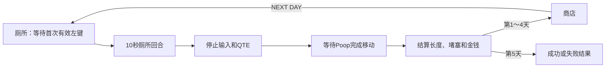

# 当前游戏机制

本文档根据当前场景和 GDScript 整理。主场景为 `res://scenes/toilet.tscn`。

## 1. 核心玩法循环

1. 进入厕所后生成 Poop，但倒计时暂不启动。
2. 第一次有效按下鼠标左键后，10 秒回合与 QTE 调度同时开始。
3. 玩家通过单击或长按延长当前 Poop 段；QTE失败会夹断并立即开始新段。
4. 倒计时归零后停止新输入与 QTE，等待活动段完成推出和所有断段完成下落。
5. 统一结算最终长度、堵塞进度和金钱。
6. 第 1～4 天可进入商店，再点击 `NEXT DAY` 开始下一天。
7. 第 5 天直接显示成功或失败结果。

主要文件：`res://scripts/toilet.gd`、`res://scripts/shop.gd`。

## 2. 玩家属性

`PlayerStats` Autoload 是以下三个整数属性的唯一数据来源：

- `storage_capacity`：储存量，初始值 `5`。
- `smoothness`：顺滑度，初始值 `5`。
- `integrity`：完整度，初始值 `5`。

三个属性范围均为 `0～10`，提供读取、设置和升级方法，并在变化时发出 `stats_changed` 信号。属性可跨厕所、商店和不同天数保留，完全关闭游戏后重置。

厕所和商店复用同一个 `StatsHUD` 组件显示三个属性。StatsHUD 初次进入时读取 PlayerStats，之后监听 `stats_changed` 实时更新，不保存另一份属性数据，也不使用每帧轮询：

- `STORAGE: 5 / 10`
- `SMOOTHNESS: 5 / 10 - NORMAL`
- `INTEGRITY: 5 / 10 - NORMAL`

顺滑度会显示 HARD、NORMAL、TOO LOOSE；完整度会显示 CRUMBLY、NORMAL、STEEL GIANT。

储存量的数据与升级接口已经实现，但具体玩法效果尚未接入，不会限制长度或产出。

主要文件：`res://scripts/player_stats.gd`、`res://scripts/components/stats_hud.gd`。

## 3. 厕所回合与鼠标输入

- 初始剩余时间为 10 秒，`CountdownTimer` 处于停止状态。
- 第一次有效左键按下会启动 Timer 和 QTE 调度，同一次输入仍正常参与判定。
- 左键按住少于 `0.3` 秒后松开，推出 `20 px`。
- 按住达到 `0.3` 秒后进入长按；长按期间当前操作不会推动 Poop。
- 松开长按时，根据按住时间一次推出 `40～120 px`。
- 按住达到 `3.0` 秒时蓄力和推出距离封顶。
- `ChargeBar` 从鼠标按下瞬间开始显示总按住时间的 `0～100%` 进度，松开或操作取消后归零。
- 单击和长按不消耗资源，倒计时期间可以不限次数操作。
- 倒计时到 0 时禁止新输入并自动释放当前操作。
- QTE失败时若正在蓄力，会取消当前操作；玩家必须松开左键后才能操作新段。
- QTE夹断、倒计时结束或其他输入取消都会清空当前蓄力；暂停时蓄力计时和显示保持冻结。
- 回合等待活动段完成已有移动、所有断段完成下落后才结算。
- `has_settled_round` 保证金钱和堵塞只结算一次。

主要文件：`res://scripts/toilet.gd`。

## 4. Poop 分段、移动与长度

- 当前活动段的 `TopMarker` 固定对齐厕所的 `PoopSpawnMarker`。
- `BottomMarker` 表示活动段最下端，推出距离累加到目标长度，并使用 `move_toward()`平滑延长。
- 占位 Sprite2D 根据 TopMarker 与 BottomMarker 的距离纵向延长，顶部保持固定且宽度不变。
- 默认移动速度为 `400 px/s`。
- 每次推出移动完成后等待 `0.3` 秒；若没有新的左键操作，Poop 会以 `20 px/s` 持续缩回。
- 新的有效左键操作会立即停止缩回并重置空闲等待，之后从当前缩回位置继续推出。
- 活动段最多缩回到0长度，到达后保持稳定；已断段不能推出、缩回或再次夹断。
- 单段长度按 `BottomMarker.global_position.y - TopMarker.global_position.y` 的非负距离计算。
- 默认 `pixels_per_cm = 10`，即 `10 px = 1 cm`。
- `PoopEndMarker` 是堵塞计算阈值，不是硬终点。
- 当前活动段超出长度按 `BottomMarker` 超过阈值的距离计算。
- Poop段状态为 `ACTIVE`、`FALLING`、`SETTLED`。断段默认使用 `0.5` 秒线性 Tween，让切断端从 Spawn 落到 End。
- QTE失败会保存当前活动段的实际长度；非零段开始下落，同时立即生成新的0长度活动段。零长度段不会播放掉落。
- 回合总长度为所有已断段的固定长度加当前活动段长度，夹断时只累计一次。
- 缩回会实时降低当前活动段长度与堵塞预览，最终价格仍按回合结束时的总长度计算。
- 回合开始前、倒计时归零后、结算期间或游戏暂停时不会缩回。

主要文件：`res://scripts/poop.gd`、`res://scripts/toilet.gd`、`res://scenes/poop.tscn`。

## 5. 顺滑度与 QTE 频率

StatsHUD 内的顺滑度显示读取 `PlayerStats.smoothness`：

- `0～4`：`HARD`，QTE 随机间隔 `1～3` 秒，正常指针速度。
- `5～7`：`NORMAL`，QTE 随机间隔 `2～5` 秒，正常指针速度。
- `8～10`：`TOO LOOSE`，QTE 随机间隔 `2～5` 秒，指针速度默认为正常值的 `1.5` 倍。

顺滑度只决定 QTE 出现频率和指针速度。规则映射集中在 `qte_rules.gd`，厕所不再保存重复的顺滑度变量。

## 6. 完整度与 QTE 判定

完整度决定 QTE 显示、目标宽度、所需成功次数和价格倍率：

- `0～4`（稀碎）：
  - 使用普通单次判定和普通目标宽度。
  - 整个 QTE 在 `0.4～1.0` 透明度之间循环，但不会完全消失。
  - 最终价值倍率为 `0.8`。
- `5～7`（正常）：
  - 使用正常显示、普通目标宽度和单次判定。
  - 最终价值倍率为 `1.0`。
- `8～10`（钢铁巨屎）：
  - 同一条 QTE 的目标宽度默认为普通宽度的 `1.5` 倍。
  - 必须连续成功两次，进度显示为 `1 / 2`、`2 / 2`。
  - 第一次成功只重新随机目标，不结束 QTE。
  - 任意一次失败都会立即结束，并且只发出一次失败信号。
  - 本轮至少成功完成一次双重 QTE 后，最终价值倍率为 `1.2`；否则为 `1.0`。

双重 QTE 直接取代普通单次 QTE，不会额外生成第二条 QTE。一次 QTE 启动时会锁定配置，过程中改变属性只影响下一次 QTE。

主要文件：`res://scripts/qte_rules.gd`、`res://scripts/components/qte_bar.gd`。

## 7. QTE 调度与夹断

- 复用 `res://scenes/components/qte_bar.tscn`，没有第二套 QTE。
- QTE 只在厕所回合开始后调度。
- 当前 QTE 成功或失败结束后，才开始下一次随机等待。
- 未激活时按空格没有效果。
- 倒计时归零时停止等待并取消当前 QTE。
- QTE 失败使 `break_count` 增加 1，并更新 `BreakCountLabel`。
- 失败会夹断当前实际长度、让旧段下落并立即生成新活动段；厕所回合和QTE调度继续。
- 双重QTE任意一次失败仍只发出一次失败信号，因此只夹断一次。
- 夹断不会直接扣除长度、堵塞或其他资源，零长度失败不会生成掉落段。
- `break_count` 当前不降低价格。

独立测试场景为 `res://scenes/tests/qte_test.tscn`，默认仍测试普通单次 QTE。

## 8. 金钱与价格

基础每厘米价格由 `Economy.money_per_cm` 保存，当前为 `0.5`。

```text
最终金钱 = floor(最终长度 × 每厘米价格 × 完整度价值倍率)
```

- 完整度 `0～4`：倍率 `0.8`。
- 完整度 `5～7`：倍率 `1.0`。
- 完整度 `8～10` 且本轮成功完成过双重 QTE：倍率 `1.2`。
- 完整度 `8～10` 但未完成双重 QTE：倍率 `1.0`。
- 夹断次数不参与价格公式。
- 厕所只通过 `MoneyEarnedLabel` 显示本轮获得的金钱，不显示累计总金钱。
- 商店通过 `TotalMoneyLabel` 显示 `Economy.total_money`。
- `Economy.total_money` 作为 Autoload 跨场景和天数保留，完全重启游戏后重置。

主要文件：`res://scripts/economy.gd`、`res://scripts/toilet.gd`。

## 9. 堵塞进度

- 每超出阈值 `1 cm` 增加 `2` 点堵塞进度。
- 回合中 `ClogProgressBar` 显示已有堵塞加本轮预览：所有 SETTLED 段完整长度，加活动段超过阈值的长度。
- FALLING段落定前不计入堵塞，落定后按完整段长度计入。
- 回合结束时才把最终增量一次性写入 `GameState.clog_progress`。
- 堵塞范围为 `0～100`，目标为 `80`，可跨场景和天数保留。

`ClogTargetLabel` 会显示当前目标百分比。当前阈值超出量使用 `BottomMarker`，不是 `TopMarker`。

## 10. 天数与商店

- 游戏共 5 天，`GameState.current_day` 初始为 1，最大为 5。
- 第 1～4 天结算后可进入商店。
- 商店的 `NEXT DAY` 只推进一天，并有防重复点击保护。
- 第 5 天根据堵塞进度是否达到 80 显示成功或失败文字。
- 商店目前只有占位商品，购买按钮不可用。
- 厕所和商店都会显示同一个 StatsHUD 实例，场景切换后继续读取同一个 PlayerStats。
- 商店尚未接入三个玩家属性的购买或升级。

主要文件：`res://scripts/game_state.gd`、`res://scripts/shop.gd`。

## 11. 暂停菜单

- 厕所和商店都复用 `res://scenes/components/pause_menu.tscn`。
- 两个场景右上角都有 `MENU` 按钮；点击它或按 `Esc`（`ui_cancel`）都会打开暂停主页。
- 暂停主页包含 `RESUME` 和 `OPTIONS`。点击 `RESUME` 或在暂停主页按 `Esc` 会继续游戏。
- `OPTIONS` 页面提供音乐音量滑动条，控制独立的 `Music` 音频总线，不影响 `Master`。
- 在 `OPTIONS` 页面按 `Esc` 或点击 `BACK` 只返回暂停主页，游戏继续保持暂停。
- 暂停时，厕所倒计时、QTE 等待计时、Poop 移动、QTE 指针与游戏输入都会停止。
- 恢复后继续使用暂停前的计时、位置、移动目标和 QTE 状态，不会重置或重新调度。
- PauseMenu 使用 `PROCESS_MODE_ALWAYS`，因此 SceneTree 暂停时仍能处理恢复输入；其他玩法节点保持默认暂停处理。
- PauseMenu 是场景内的可复用组件，不是 Autoload。组件退出场景树时会清理由自身设置的暂停状态。
- 音乐音量在当前游戏运行期间跨场景保留，但不会保存到磁盘；当前尚未添加实际背景音乐。
- 当前没有重开本日、主菜单、退出游戏、音效音量或其他设置。

主要文件：`res://scenes/components/pause_menu.tscn`、`res://scripts/components/pause_menu.gd`、`res://default_bus_layout.tres`。

## 12. 当前场景流程



## 13. 重要可调参数

| 参数 | 文件 | 默认值 | 作用 |
| --- | --- | ---: | --- |
| `poop_move_speed` | `toilet.gd` | `400.0` | Poop移动速度 |
| `click_max_duration` | `toilet.gd` | `0.3` | 单击和长按分界 |
| `click_push_distance` | `toilet.gd` | `20.0` | 单击推出距离 |
| `max_charge_duration` | `toilet.gd` | `3.0` | 最大蓄力总时间 |
| `min/max_charge_push_distance` | `toilet.gd` | `40 / 120` | 长按推出距离范围 |
| `idle_retract_delay` | `toilet.gd` | `0.3` | 推出完成后的空闲缩回等待时间 |
| `poop_retract_speed` | `toilet.gd` | `20.0` | Poop缩回速度（像素/秒） |
| `fall_duration` | `poop.gd` | `0.5` | 断段从Spawn落到End的Tween时长 |
| `hard_qte_min/max_interval` | `toilet.gd` | `1 / 3` | HARD QTE间隔 |
| `normal_qte_min/max_interval` | `toilet.gd` | `2 / 5` | 其他QTE间隔 |
| `normal_qte_pointer_speed` | `toilet.gd` | `400.0` | 正常指针速度 |
| `loose_qte_speed_multiplier` | `toilet.gd` | `1.5` | 过稀速度倍率 |
| `high_integrity_target_width_multiplier` | `toilet.gd` | `1.5` | 高完整度目标宽度倍率 |
| `target_area_width` | `qte_bar.gd` | `120.0` | 普通目标宽度 |
| `faded_min_alpha` | `qte_bar.gd` | `0.4` | 稀碎QTE最低透明度 |
| `faded_pulse_speed` | `qte_bar.gd` | `3.0` | 透明度变化速度 |
| `pixels_per_cm` | `poop.gd` | `10.0` | 像素到厘米换算 |
| `money_per_cm` | `economy.gd` | `0.5` | 每厘米基础价格 |

## 14. 尚未完成或尚未接入

- 储存量：数据和升级接口已实现，具体玩法效果尚未接入。
- 属性商店：商店尚未提供属性购买或升级。
- 夹断表现目前使用整段占位图下落，没有正式断裂美术或额外动画。
- 第 5 天只有占位结果文字。
- 没有磁盘存档，关闭游戏后属性、天数、堵塞和金钱都会重置。
