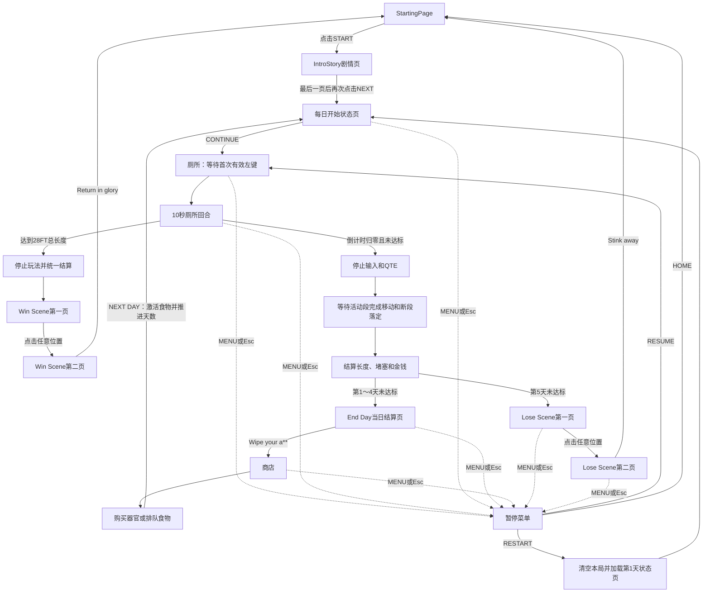

# 当前游戏机制

本文档根据当前场景和 GDScript 整理。项目主场景为 `res://scenes/StartingPage.tscn`，点击START后先进入 `res://scenes/IntroStory.tscn`，完成剧情页后进入每日开始状态页，再由玩家继续进入厕所。

## 1. 核心玩法循环

1. 启动项目后显示StartingPage；点击START进入IntroStory剧情页。
2. 玩家逐页点击NEXT，让剧情纸张从厕纸后移动到中央；最后一页显示完成后再次点击进入每日开始状态页。
3. 每日开始页根据当前天数显示对应的5days至1days整页图片，并在图片上叠加三个厕所玩法器官的当前实际效果和当天生效食物；大肠与腹肌使用向下截断一位小数的FT显示基础效果，并在括号中单独显示食物原始加成点数，括约肌显示HIGH/MID/LOW夹断风险；点击页面任意位置进入厕所。
4. 进入厕所后生成 Poop，但倒计时暂不启动。
5. 第一次有效按下鼠标左键后，10 秒回合与 QTE 调度同时开始。
6. 玩家通过单击或长按延长当前 Poop 段；QTE失败会夹断并立即开始新段。
7. 本轮全部Poop段实际总长度达到统一派生的堵塞长度目标时立即停止回合；否则倒计时归零后停止新输入与 QTE，并等待活动段完成推出和所有断段完成下落。
8. 统一结算最终长度、最长连续段和金钱。
9. 任意一天达到长度目标都会完成唯一一次结算并进入Win Scene；第 1～4 天未达标时，结算后进入End Day当日结果页，点击`Wipe your a**`进入商店，再推进到从0长度开始的下一天。
10. 第 5 天仍未达到当天目标时显示失败结果。

主要文件：`res://scripts/toilet.gd`、`res://scripts/shop.gd`。

## 2. 玩家属性

`PlayerStats` Autoload 是以下三个整数属性的唯一数据来源：

- `storage_capacity`：储存量，初始值 `5`。
- `smoothness`：顺滑度，初始值 `5`。
- `integrity`：完整度，初始值 `5`。

三个属性范围均为 `0～10`，提供读取、设置和升级方法，并在变化时发出 `stats_changed` 信号。属性可跨厕所、商店和不同天数保留，完全关闭游戏后重置。

`StatsHUD`仍作为可复用组件保留，但当前正式场景没有实例化该旧属性面板。大肠的无限FT加成不写入0～10基础属性，而是在Shop、DayStart和实际厕所储备中读取。组件如被测试场景或后续UI实例化，会读取有效属性并监听`PlayerStats.stats_changed`与`FoodSystem.food_state_changed`，不保存另一份属性数据：

- `STORAGE: 5 / 10`
- `SMOOTHNESS: 5 / 10 - NORMAL`
- `INTEGRITY: 5 / 10 - NORMAL`

顺滑度会显示 HARD、NORMAL、TOO LOOSE；完整度会显示 CRUMBLY、NORMAL、STEEL GIANT。

储存量会限制每轮可加入推出目标的Poop总量：每点有效储存量提供 `3 FT`（`91.44 cm`）储备。有效储存量 `5` 时每轮为 `15 FT`（`457.2 cm`），有效储存量 `10` 时为 `30 FT`（`914.4 cm`）。

主要文件：`res://scripts/player_stats.gd`、`res://scripts/components/stats_hud.gd`。

## 3. 器官升级

`OrganProgression` Autoload 是三种器官等级的唯一数据来源，等级可跨厕所、商店和天数保留，完全关闭游戏后重置：

- 大肠和腹肌初始为 `0` 级且没有等级上限；括约肌初始为HIGH（0级），购买一次变为MID（1级），再次购买变为LOW（2级）并达到MAX。
- 下一级价格为 `(当前等级 + 1) × 30`，依次为 `30、60、90、120、150`。
- `OrganProgression`通过 `Economy.try_spend_money()`安全扣除现有总金钱；钱不足或满级时不能升级。
- 商店新UI已经接入大肠、腹肌和括约肌三个购买按钮、实际效果文字、下一价格和总金钱；旧`MainMargin`已从场景中删除。
- 大肠每升一级为本轮最大Poop储备增加精确 `91.44 cm`（`3 FT`）。基础/食物储存点仍由`PlayerStats`保存，大肠厘米加成由等级实时派生，不写入第二份容量状态。
- 腹肌每升一级在满蓄力时增加精确 `45.72 cm`（`1.5 FT`）推出距离；未满蓄力时按当前`charge_ratio`加入对应比例的额外距离，然后应用食物Charge倍率。
- 腹肌不改变基础长按范围 `40～150 px = 40～150 cm ≈ 1.31～4.92 FT`，只在其上增加按蓄力比例计算的奖励。
- 普通单击始终推出 `20 px = 20 cm ≈ 0.66 FT`；腹肌不会改变3秒最大蓄力时间或蓄力条增长速度。
- 括约肌直接决定拼接式QTE目标区域的Center格数：HIGH为3格、MID为5格、LOW为7格；Left和Right端点始终各一个。
- 括约肌同时影响轨道速度和QTE等待间隔：HIGH为速度`×1.0`/间隔`×1.0`，MID为速度`×0.85`/间隔`×1.25`，LOW为速度`×0.7`/间隔`×1.5`；不改变透明度或所需连续成功次数。
- 每次进入厕所会按当前储存量重新装满本轮储备；同一轮所有活动段和夹断后的新段共享该储备。
- 单击和长按都会在加入推出目标时消费储备；长按先加入腹肌蓄力比例奖励并应用食物倍率，再由剩余储备限制实际推出距离。
- 剩余储备不足时只推出剩余部分；归零后不能继续推出，但倒计时与QTE仍正常运行。
- Poop缩回、QTE夹断或已消费但尚未完成的移动都不会返还储备。

主要文件：`res://scripts/organ_progression.gd`、`res://scripts/economy.gd`、`res://scripts/shop.gd`。

## 4. 食物系统

第一版食物定义集中在 `res://scripts/food/food_definitions.gd`：

| 食物 | 价格 | 蓄力 | 储存量 | 顺滑度 | 完整度 | 价值 |
| --- | ---: | ---: | ---: | ---: | ---: | ---: |
| 西梅 | $5 | +1 | +2 | +3 | -1 | x1.0 |
| 咖啡 | $5 | +2 | 0 | +2 | -2 | x1.0 |
| 红薯 | $10 | 0 | +3 | -2 | +2 | x1.2 |
| 牛油果 | $15 | +1 | +2 | +2 | +1 | x1.3 |
| 香蕉 | $15 | 0 | 0 | 0 | 0 | x1.35 |

- `FoodSystem`是唯一的跨场景食物状态，分别保存商店待生效食物与当前厕所回合食物。
- 每个商店天数首次进入时，`FoodSystem`从全部有效定义中无重复随机最多3种商品；同一天刷新UI、购买或重新进入Shop不会重新随机，下一商店天数才重新生成。
- 三个商品格只是展示位置，不是购买容量。食物在商店购买时立即通过 `Economy`扣钱；玩家可以买下当天展示的全部不同食物，但每个食物ID在该商店阶段最多购买一份。
- 商品格使用`FoodDefinitions`集中映射的Normal图片，价格与小Poop货币图标固定显示在普通图标下方。香蕉沿用原玉米的价格与效果数值，只替换显示身份和素材。
- 三个商品格复用唯一的`FoodHoverCard`；Hover时使用该食物的宽版Hover图片，并把名称与非零效果显示在图片右侧自带的信息Box内，不显示价格。Hover层不参与商品布局或鼠标点击，也不会被商品容器裁切。
- 购买成功后按钮切换到对应Purchased图片并禁用，价格行继续保留；已购买商品仍可Hover查看效果，不再使用临时`BOUGHT`文字。
- 点击 `NEXT DAY` 后待生效食物转为当前回合效果；该厕所回合完成统一结算后清除。
- `NEXT DAY`激活全部pending食物并清空pending列表，因此下一次商店阶段可再次购买同一种食物，不保存永久购买记录。
- 第1天没有上一个商店阶段，因此默认没有食物效果；食物效果清除后，有效属性恢复为基础属性。
- 食物不会写回 `PlayerStats`基础属性。有效属性为“基础属性 + 当前食物加成”，并限制在 `0～10`。
- 食物蓄力每 `+1` 让腹肌奖励加入后的长按推出距离增加 `10%`；不影响单击或3秒蓄力上限。
- 多份食物价值采用加法：`1.0 + Σ(单份倍率 - 1.0)`，最高为 `x2.0`。
- 当前没有食物槽、背包、退款、同阶段重复购买、特殊配方或持久化存档；五种商品已接入Normal、Hover和Purchased三状态素材。

主要文件：`res://scripts/food/food_system.gd`、`res://scripts/player_stats.gd`、`res://scripts/shop.gd`。

## 5. 厕所回合与鼠标输入

- 初始剩余时间为 10 秒，`CountdownTimer` 处于停止状态。
- 第一次有效左键按下会启动 Timer 和 QTE 调度，同一次输入仍正常参与判定。
- 左键按住少于 `0.3` 秒后松开，推出 `20 px = 20 cm`。
- 按住达到 `0.3` 秒后进入长按；长按期间当前操作不会推动 Poop。
- 松开长按时，根据按住时间计算基础范围 `40～150 px = 40～150 cm`，按蓄力比例加入腹肌奖励，再应用食物倍率。
- 按住达到 `3.0` 秒时蓄力和推出距离封顶。
- 单击和长按不消耗体力，但会消耗本轮共享的Poop储备；储备仍有剩余时可以不限次数操作。
- 倒计时到 0 时禁止新输入并自动释放当前操作。
- QTE失败时若正在蓄力，会取消旧段的当前操作；若左键仍按住，新连接段会从0重新开始蓄力，无需先松开。
- QTE夹断、倒计时结束或其他输入取消都会清空当前蓄力；暂停时蓄力计时保持冻结。
- 回合等待活动段完成已有移动、所有断段完成下落后才结算。
- `has_settled_round` 保证金钱和堵塞只结算一次。

主要文件：`res://scripts/toilet.gd`。

## 6. Poop 分段、移动与长度

- 当前活动段的 `TopMarker` 固定对齐厕所的 `PoopSpawnMarker`。
- `BottomMarker` 表示活动段最下端，推出距离累加到目标长度，并使用 `move_toward()`平滑延长。
- Poop视觉由统一比例的`TopCap + Body + BottomCap`组成；活动段隐藏TopCap，Body使用区域裁切与平铺跟随逻辑长度延长，BottomCap始终跟随BottomMarker。
- Body纹理不会纵向压缩或拉伸；短段只显示裁切区域，超过单张Body高度时继续无缝平铺。
- 默认移动速度为 `400 px/s = 400 cm/s ≈ 13.12 FT/s`。
- 每次推出移动完成后等待 `0.3` 秒；若没有新的左键操作，Poop 会以 `20 px/s = 20 cm/s ≈ 0.66 FT/s` 持续缩回。
- 新的有效左键操作会立即停止缩回并重置空闲等待，之后从当前缩回位置继续推出。
- 活动段最多缩回到0长度，到达后保持稳定；已断段不能推出、缩回或再次夹断。
- 单段长度按 `BottomMarker.global_position.y - TopMarker.global_position.y` 的非负距离计算。
- 所有单位换算集中在普通静态工具`LengthUnits`：`1 px = 1 cm`，`1 FT = 30.48 cm = 30.48 px`；Poop不再提供Inspector可覆盖的换算率。
- `PoopEndMarker` 是堵塞计算阈值，不是硬终点。
- `TubeIndicator`复用厕所中的Tube动画：任一活动、下落或落定Poop段到达`PoopEndMarker`后播放流动动画；没有有效Poop留在管道区域时恢复空管并停止。
- Tube内部使用现有`poop_body`与`poop_bottom`显示一条裁切式迷你Poop：刚到达`PoopEndMarker`时显示BottomCap，继续深入时Body向下平铺延长；缩回或所有有效段离开阈值后隐藏。多段同时进入管道时显示其中最深的视觉长度，达到内部裁切区底部后只停止视觉延长，不影响真实长度和胜利判断。
- Tube下方按本轮所有固定断段长度与当前active段实际长度的总和显示剩余距离；统一目标由`GameState.CLOG_TARGET_FEET = 28`通过`LengthUnits`换算为`853.44 cm`，再向上取整为`nFT TO CLOG`。active段缩回会让剩余距离重新增加，实际总长度达到目标时显示`0FT TO CLOG`。
- 厕所左侧的`PoopReserveHUD`显示当天仍可推出的Poop储备：最大值继续由基础储存属性、当前食物储存加成与大肠升级共同组成，并直接读取本轮唯一的`PoopReserve`。
- 推出操作消费储备后，HUD以接近Poop实际推出速度从顶部平滑减少，底部保持对齐；文字按当前平滑显示值向上取整为整数FT。缩回与QTE夹断不返还储备，新一天或Restart重新装满。
- Poop段状态为 `ACTIVE`、`FALLING`、`SETTLED`。QTE夹断时显示TopCap并冻结当时的Body长度，完整的Top、Body和Bottom作为同一段使用 `0.5` 秒线性 Tween 从 Spawn 落到 End。
- QTE失败会保存当前活动段的实际长度；非零段开始下落，同时立即生成新的0长度活动段。`Shit Drop.wav`不会在夹断瞬间播放，而是每个非零断段抵达`PoopEndMarker`时各播放一次；零长度段和普通active段不会触发该音效。
- QTE夹断只分离当前已推出部分，不会结束回合；系统会立即生成新的连接段，玩家可以继续产出。
- QTE激活期间，厕所倒计时、Poop推出、缩回和掉落全部暂停；QTE本身继续运行。判定结束后，未结束的回合恢复。
- QTE激活期间Tube流动动画和内部迷你Poop预览都冻结；判定结束后重新检查真实管道状态，仅在仍有Poop时继续播放和更新预览。
- QTE激活期间PoopReserveHUD的填充与文字过渡也暂停，判定结束后从原显示值继续追赶PoopReserve的真实剩余值。
- QTE正式激活时，厕所的`left_door`会携带子节点提示文字快速左右震动；提示内容每次从Toilet Inspector的`qte_warning_texts`候选数组中随机选择。成功、失败、取消、回合结束或场景退出时统一停止Tween、恢复门的初始位置并隐藏提示，下一次QTE可重新触发且不会累计位置偏移。
- 玩家有效按住左键蓄力时，仅`Toilet/Butt`视觉图片会围绕初始位置轻微左右抖动；松开、QTE开始、储存耗尽、输入取消、回合结束或场景退出时统一停止Tween并精确复位，不移动Poop Marker或其他逻辑节点。
- 回合总长度为所有已断段的固定长度加当前活动段长度，夹断时只累计一次。
- 缩回会实时降低当前活动段长度与堵塞预览，最终价格仍按回合结束时的总长度计算。
- 回合开始前、倒计时归零后、结算期间或游戏暂停时不会缩回。

主要文件：`res://scripts/poop.gd`、`res://scripts/toilet.gd`、`res://scenes/poop.tscn`。

## 7. 顺滑度与 QTE 频率

厕所QTE读取 `PlayerStats`提供的有效顺滑度；保留的StatsHUD组件使用同一来源：

- `0～4`：`HARD`，QTE基础随机间隔 `1～3` 秒，正常轨道速度。
- `5～7`：`NORMAL`，QTE基础随机间隔 `2～5` 秒，正常轨道速度。
- `8～10`：`TOO LOOSE`，QTE基础随机间隔 `2～5` 秒，轨道速度默认为正常值的 `1.5` 倍。

顺滑度先决定QTE基础等待范围和轨道速度，再应用括约肌倍率。规则映射集中在 `qte_rules.gd`，厕所不再保存重复变量。

## 8. 完整度与 QTE 判定

当前有效完整度只决定 QTE 透明显示、所需成功次数和价格倍率，不再改变目标宽度：

- `0～4`（稀碎）：
  - 使用普通单次判定。
  - 整个 QTE 在 `0.4～1.0` 透明度之间循环，但不会完全消失。
  - 最终价值倍率为 `0.8`。
- `5～7`（正常）：
  - 使用正常显示和单次判定。
  - 最终价值倍率为 `1.0`。
- `8～10`（钢铁巨屎）：
  - 必须连续成功两次，进度显示为 `1 / 2`、`2 / 2`。
  - 第一次成功只重新随机目标，不结束 QTE。
  - 任意一次失败都会立即结束，并且只发出一次失败信号。
  - 本轮至少成功完成一次双重 QTE 后，最终价值倍率为 `1.2`；否则为 `1.0`。

双重 QTE 直接取代普通单次 QTE，不会额外生成第二条 QTE。一次 QTE 启动时会锁定配置，过程中改变属性只影响下一次 QTE。

主要文件：`res://scripts/qte_rules.gd`、`res://scripts/components/qte_bar.gd`。

## 9. QTE 调度与夹断

- 复用 `res://scenes/components/qte_bar.tscn`，没有第二套 QTE。
- QTE使用Pixel Art拼接视觉：Frame位于轨道后方作可视外框，VisibleWindow裁切超长MovingTrack；Target由Left、3/5/7个独立Center和Right无缝组成，Center不会横向拉伸。
- MovingTrack由MissBefore、Target和MissAfter组成，共45格且Target前后至少各有9格Miss；每次启动按单格宽度随机Target位置，并从窗口右侧向左单向移动。
- Pointer固定在VisibleWindow中央，不随轨道移动；按空格时以Pointer中心是否位于当前Target全局水平范围内判定。轨道完全离开窗口而未输入会自动失败。
- QTE 只在厕所回合开始后调度。
- 当前 QTE 成功或失败结束后，才开始下一次随机等待。
- 未激活时按空格没有效果。
- 倒计时归零时停止等待并取消当前 QTE。
- 失败会夹断当前实际长度、让旧段下落并立即生成新活动段；厕所回合和QTE调度继续。
- 双重QTE任意一次失败仍只发出一次失败信号，因此只夹断一次。
- QTE组件共用`QTEBar/ResultSFX`播放最终判定音效：只有发出最终`qte_succeeded`或`qte_failed`时分别播放一次成功或失败音效；双重QTE的中间成功、`cancel_qte()`取消和场景退出不播放结果音效。
- 夹断不会直接扣除长度、堵塞或其他资源，零长度失败不会生成掉落段。

独立测试场景为 `res://scenes/tests/qte_test.tscn`，可选择HIGH、MID、LOW并验证3/5/7个Center、轨道速度倍率和等待间隔倍率；选择只影响下一次启动的QTE。

## 10. 金钱与价格

基础每厘米价格由 `Economy.money_per_cm` 保存，当前为 `0.3`。

```text
最终金钱 = floor(最终长度 × 每厘米价格 × 完整度价值倍率 × 食物价值倍率)
```

- 完整度 `0～4`：倍率 `0.8`。
- 完整度 `5～7`：倍率 `1.0`。
- 完整度 `8～10` 且本轮成功完成过双重 QTE：倍率 `1.2`。
- 完整度 `8～10` 但未完成双重 QTE：倍率 `1.0`。
- 夹断次数不参与价格公式。
- 食物价值倍率使用当前回合已激活食物的加法结果，并限制在 `x1.0～x2.0`。
- 厕所结算本轮收入并保存到End Day只读快照；厕所旧MoneyEarnedLabel已移除。
- 商店通过 `TotalMoneyLabel` 显示 `Economy.total_money`。
- `Economy.total_money` 作为 Autoload 跨场景和天数保留，完全重启游戏后重置。

主要文件：`res://scripts/economy.gd`、`res://scripts/toilet.gd`。

## 11. 当天堵塞长度

- `GameState.CLOG_TARGET_FEET = 28`是唯一堵塞目标配置，通过`LengthUnits`换算为`853.44 cm`。
- 当天有效总长度为“所有已经QTE夹断并固定的Poop段长度＋当前active段实际长度”；每个固定段只累计一次。
- active段缩回会降低当天总长度，已经夹断的固定段不会缩回；长度不跨天保存，新一天从0开始。
- 旧厕所`ClogProgressBar`已移除；End Day距离条按`clamp(当天总长度 / 853.44 cm, 0, 1)`显示，不再使用抽象progress点数。
- 任意一天总长度首次达到`28 FT`都会立即锁定输入、Timer、QTE与Poop运动，复用统一结算一次后进入`res://scenes/win.tscn`。
- `PoopEndMarker`只负责Tube流动视觉触发，不改变总长度、胜利判定或剩余距离数值。

厕所旧`ClogTargetLabel`已移除；Tube与End Day继续读取统一的`28 FT`目标。

## 12. 天数与商店

- 游戏共 5 天，`GameState.current_day` 初始为 1，最大为 5。
- 第 1～4 天未达标完成唯一一次结算后进入`res://scenes/end_day.tscn`；点击该页的`Wipe your a**`按钮才进入商店。厕所不再提供全屏点击或旧ENTER SHOP入口。
- End Day显示刚完成的天数、本轮收入、当天堵塞目标的剩余距离，以及当天最长的一段未被QTE夹断的连续Poop长度；页面只读取`GameState`中的上一轮结算快照，不重复加钱或修改堵塞。
- Longest Streak在每次QTE夹断时记录断段最终实际长度，并在回合结束时记录最后active段实际长度，再取当天最大值；缩回后的长度生效，显示时按`floor(cm / 30.48)`转换为整数FT。
- Distance till clogging使用`max(853.44 cm - 本轮最终Poop总长度, 0)`，再向下转换为整数FT；三段距离条按`最终总长度 / 853.44 cm`显示，不参与玩法计算。
- 商店的 `NEXT DAY` 只推进一天，并有防重复点击保护。
- `NEXT DAY` 会先激活排队食物并推进天数，再进入唯一的 `res://day_start.tscn`；每日状态页不会维护第二份日期或食物记录。
- 每日状态页按 `GameState.MAX_DAYS - current_day + 1` 显示 `5 DAYS` 至 `1 DAY`，单数使用 `DAY`。
- 页面中部显示大肠、括约肌和腹肌的当前实际效果，不显示器官等级；数值直接读取 `PlayerStats`、`OrganProgression`和现有厕所距离接口。
- `FoodContainer` 横向显示 `FoodSystem` 当前active食物，多个食物按现有数组顺序生成；没有当天食物时容器保持为空。名称与图标均读取当前`FoodDefinitions`定义。
- 点击每日状态页的 `CONTINUE` 才进入厕所；厕所Timer仍等待第一次有效左键输入。
- 商店推进到下一天时调用`GameState.advance_day()`；新的Toilet场景重新创建本轮Poop段，因此当天总长度自然从0开始。
- 任意一天达到28FT（853.44cm）总长度会进入两阶段Win Scene；第5天仍未达标完成唯一结算后进入现有`res://Losescreen.tscn`，不进入Win、End Day或商店。
- Win Scene第一阶段显示`win_first_scene.png`，进入后等待3秒才启用全屏点击；前3秒点击无效，解锁后必须重新按下才能进入第二阶段。第二阶段显示`win_second_scene.png`，只有`Return in glory`图片按钮可以离开。返回时清空全部本局数据并进入StartingPage，Music总线音量保持不变。
- Lose Scene第一阶段显示`lose_first_scene.png`，进入后等待3秒才启用全屏点击；前3秒点击无效，解锁后必须重新按下才能进入第二阶段。第二阶段显示`lose_second_scene.png`，下一帧才启用`Stink away`图片按钮。按钮复用GameState的Home重置入口清空本局、解除暂停并返回StartingPage，Music总线音量保持不变。
- 商店旧 `MainMargin` 及其旧器官、食物、排队预览和 `NEXT DAY` UI 已删除；当前只保留 `ShopBackground`、`NewShopUI` 与共用暂停菜单。
- 可见的 `NewShopUI` 显示总金钱、三个器官实际效果及购买按钮。大肠和腹肌按钮持续显示递增价格；括约肌到LOW后显示MAX；余额不足时对应按钮禁用。
- 当前使用占位的 `TemporaryLeaveShopButton` 执行原有跨天流程：激活全部pending食物、推进一天并进入每日状态页，且有防重复点击保护。
- `NewShopUI`包含3个每日随机食物商品格与共用Tooltip；当天商品固定，玩家可购买展示出的全部3种，购买后立即扣钱并登记为pending，下一天自动生效。
- 五种食物均已接入独立Purchased图片；购买成功后保持原商品位置并切换图片，按钮禁用但仍可查看Hover信息。
- 食物购买只有在`FoodSystem.try_purchase_food()`完成扣款并成功加入pending列表后才由共用的`Shop/FoodPurchaseSFX`播放一次`Eat _ Buy food.wav`；余额不足、重复购买或其他失败不会播放。
- 全局`UISFX`使用唯一的`/root/UISFX/PaperButtonSFX`监听新加入场景树的`Button`与`TextureButton`，在有效按下时播放一次`Paper _ button press.wav`。它不逐帧扫描，运行时生成的食物按钮也自动接入；StartingPage按场景路径排除并继续使用自身Flush按钮音效。
- 器官升级后，商店会立即刷新总金钱、器官效果与按钮状态。
- 当前Shop与Toilet均不显示旧StatsHUD属性状态栏，但跨场景属性仍由同一个PlayerStats保存；Shop和DayStart显示器官实际效果。
- 商店尚未接入三个玩家属性的购买或升级。

主要文件：`res://scripts/game_state.gd`、`res://scripts/shop.gd`。

## 13. 暂停菜单

- 厕所、商店、每日开始页、当日结算页和Lose Scene都复用 `res://scenes/components/pause_menu.tscn`；StartingPage、IntroStory与Win Scene不显示暂停菜单。
- 这五个场景右上角都有像素素材的菜单按钮；点击它或按 `Esc`（`ui_cancel`）会打开暂停层。菜单打开后，全屏 `InputBlocker` 会拦截底层鼠标输入。
- `RESUME` 解除全局暂停并回到打开菜单前的场景和状态；在菜单打开时按 `Esc` 也执行相同恢复行为。
- `RESTART` 不再显示二次确认页。点击后立即把天数恢复为1、堵塞与总金钱归零、三项基础属性恢复5、三种器官恢复0级，并清空随机商品、待生效食物、当前生效食物与上一轮结算快照，然后解除暂停并进入第1天每日状态页。
- `HOME` 使用同一套本局重置入口清空上述进度，解除暂停后进入 `res://scenes/StartingPage.tscn`。
- 菜单内的自定义像素音量条直接读取和控制唯一的 `Music` 音频总线：点击或拖动可以调节音量，0时静音；它不影响 `Master`，也不保存额外音量副本。
- 重新开始进入每日状态页后，点击CONTINUE进入的新厕所中，10秒Timer仍保持停止，直到第一次有效左键输入。
- `RESTART`和`HOME`都不会重置Music总线音量；当前没有退出游戏或磁盘设置保存功能。
- 暂停时，厕所倒计时、QTE等待计时、Poop移动、QTE轨道与游戏输入都会停止。
- 恢复后继续使用暂停前的计时、位置、移动目标和 QTE 状态，不会重置或重新调度。
- PauseMenu 使用 `PROCESS_MODE_ALWAYS`，因此 SceneTree 暂停时仍能处理恢复输入；其他玩法节点保持默认暂停处理。
- PauseMenu 是场景内的可复用组件，不是 Autoload。组件退出场景树时会清理由自身设置的暂停状态。
- 音乐音量在当前游戏运行期间跨场景保留，但不会保存到磁盘；Lobby与In-game背景音乐由全局MusicPlayer连续管理。

主要文件：`res://scenes/components/pause_menu.tscn`、`res://scripts/components/pause_menu.gd`、`res://default_bus_layout.tres`。

## 14. Autoload 与本局重置

当前 `project.godot` 注册了七个 Autoload，每种跨场景状态只有一个数据来源；`UISFX`与`MusicPlayer`只提供音频播放，不保存玩法状态：

| Autoload | 保存的数据 | `RESTART RUN` 时的重置 |
| --- | --- | --- |
| `Economy` | `total_money` 与每厘米价格配置 | 总金钱归零；`money_per_cm` 配置保持不变 |
| `GameState` | 当前天数、28FT目标与上一轮只读结算快照 | 恢复第1天、清空结算快照，并协调其他系统重置与每日状态页切换 |
| `PlayerStats` | 三项永久基础属性 | 储存量、顺滑度、完整度恢复为5 |
| `OrganProgression` | 大肠、括约肌、腹肌三种器官等级 | 全部恢复0级 |
| `FoodSystem` | 待生效与当前生效食物ID | 两个列表全部清空 |
| `UISFX` | 跨场景共用的Paper按钮AudioStreamPlayer | 不保存本局数据，无需重置 |
| `MusicPlayer` | 跨场景连续播放Lobby或In-game背景音乐 | 不保存本局数据，Music总线音量不重置 |

Music总线音量不是本局玩法进度，不属于Autoload，也不会被 `RESTART RUN` 重置。当前没有磁盘存档，完全关闭游戏后会使用脚本与音频总线布局的默认值。

`MusicPlayer`是跨场景保留的唯一背景音乐播放器。StartingPage与IntroStory在`Music`总线连续循环播放`Lobby BGM.wav`；从IntroStory进入DayStart时切换为`In game BGM.wav`。DayStart、Toilet（包括QTE期间）、EndDay与Shop之间复用同一In-game播放实例和当前进度，不因切换场景重新开始。进入Win或Lose Scene时停止背景音乐；从结局返回StartingPage后重新播放Lobby音乐。两首音乐都继续受PauseMenu的Music总线音量控制。

## 15. 当前场景流程



暂停恢复实际会返回打开菜单前的原场景和状态；图中的 `RESUME → 厕所等待` 仅表示恢复入口，不表示会重置或切换场景。

## 16. 正式场景、组件与测试入口

- 正式入口：`res://scenes/StartingPage.tscn`，由 `project.godot` 的主场景UID指向。
- 正式流程场景：`res://scenes/StartingPage.tscn`、`res://scenes/IntroStory.tscn`、`res://day_start.tscn`、`res://scenes/toilet.tscn`、`res://scenes/end_day.tscn`、`res://scenes/shop.tscn`、`res://scenes/win.tscn`与`res://Losescreen.tscn`。
- StartingPage的START按钮进入IntroStory，不会直接进入厕所。
- IntroStory由Inspector中的 `story_pages` 提供剧情文字。每次NEXT都会在固定出口实例化一张新的StoryPaperPage；所有页面都是PaperChain的子节点并保持固定局部间距。过渡时只使用一个线性Tween整体移动PaperChain，让新页到达中央、旧页同步向右推进并保持少量重叠，避免连接处短暂断开。移动期间按钮禁用，完成后厕纸暂停在当前帧。
- 最后一页出现时不会自动离开；玩家再次点击NEXT才进入每日状态页。空的 `story_pages` 会在第一次点击时直接进入每日状态页。
- 每日状态页复用GameState、PlayerStats、OrganProgression、FoodSystem与FoodDefinitions，只负责显示当前日状态和继续进入厕所，不保存重复数据。
- Poop场景：`res://scenes/poop.tscn`。
- 可复用组件：
  - `res://scenes/components/qte_bar.tscn`
  - `res://scenes/components/stats_hud.tscn`
  - `res://scenes/components/pause_menu.tscn`
- 独立测试场景：`res://scenes/tests/qte_test.tscn`。它测试普通单次QTE、2～5秒随机调度及HIGH/MID/LOW的3/5/7格目标，没有接入厕所、金钱或天数流程。
- `scenes/resources`中的图片以及厕所、商店中的部分视觉仍是占位内容，不代表额外玩法。

## 17. 重要可调参数

| 参数 | 文件 | 默认值 | 作用 |
| --- | --- | ---: | --- |
| `poop_move_speed` | `toilet.gd` | `400.0` | Poop移动速度 |
| `click_max_duration` | `toilet.gd` | `0.3` | 单击和长按分界 |
| `click_push_distance` | `toilet.gd` | `20.0` | 单击推出距离 |
| `max_charge_duration` | `toilet.gd` | `3.0` | 最大蓄力总时间 |
| `min/max_charge_push_distance` | `toilet.gd` | `40 / 150` | 长按推出距离基础范围 |
| `FEET_PER_STORAGE_POINT` | `poop_reserve.gd` | `3.0` | 每点有效储存量提供的英尺储备 |
| `idle_retract_delay` | `toilet.gd` | `0.3` | 推出完成后的空闲缩回等待时间 |
| `poop_retract_speed` | `toilet.gd` | `20.0` | Poop缩回速度（像素/秒） |
| `fall_duration` | `poop.gd` | `0.5` | 断段从Spawn落到End的Tween时长 |
| `hard_qte_min/max_interval` | `toilet.gd` | `1 / 3` | HARD QTE间隔 |
| `normal_qte_min/max_interval` | `toilet.gd` | `2 / 5` | 其他QTE间隔 |
| `normal_qte_track_speed` | `toilet.gd` | `400.0` | 正常MovingTrack速度 |
| `loose_qte_track_speed_multiplier` | `toilet.gd` | `1.5` | 过稀时的轨道速度倍率 |
| `track_speed` | `qte_bar.gd` | `400.0` | QTE组件独立使用时的默认轨道速度；厕所会在每次QTE前配置实际速度 |
| `faded_min_alpha` | `qte_bar.gd` | `0.4` | 稀碎QTE最低透明度 |
| `faded_pulse_speed` | `qte_bar.gd` | `3.0` | 透明度变化速度 |
| `PIXELS_PER_CM` | `length_units.gd` | `1.0` | 全项目唯一像素到厘米换算 |
| `CENTIMETERS_PER_FOOT` | `length_units.gd` | `30.48` | 全项目唯一厘米到英尺换算 |
| `CLOG_TARGET_FEET` | `game_state.gd` | `28.0` | 当天胜利长度目标 |
| `money_per_cm` | `economy.gd` | `0.3` | 每厘米基础价格 |

器官升级价格、长度加成、储存换算和堵塞目标目前是脚本常量，不是Inspector导出项：价格每级增加30，大肠每级增加3FT储备，腹肌每级增加1.5FT满蓄力距离，括约肌最高2级，每点基础/食物储存量提供3FT；当天堵塞目标为28FT。

## 18. 尚未完成或尚未接入

- 玩家属性商店：商店尚未提供储存量、顺滑度或完整度购买。
- 食物扩展：当前已有五种固定食物、每日效果及三状态商品素材，但没有背包、更多食物、特殊配方或退款。
- 第5天失败已接入两阶段Lose Scene。
- 暂停设置只有Music总线音量；已有Lobby与In-game背景音乐，但没有独立音效音量选项或磁盘设置保存。
- 没有磁盘存档，关闭游戏后属性、天数、堵塞和金钱都会重置。
